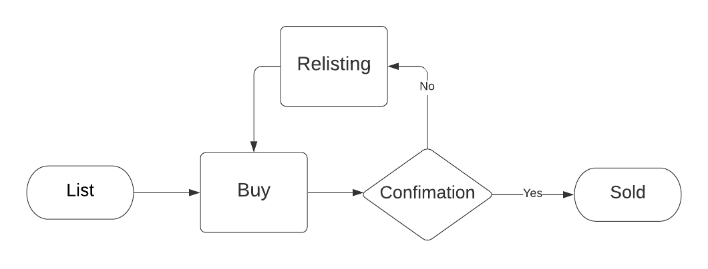

# Assignment 1→Report

### Team members

**⇒** **Aakash Jain** →2019101028

**⇒** **Ishaan Shah** →2019111028

**⇒** **Zeeshan Ahmed** → 2019111024

### Problem Statement

To create a marketplace with the help of smart contracts that will allow the members of the community to buy and sell securely with the help of Smart Contracts

## Program Logic

The program is written in Solidity and is tested on truffle. The contract contains a `struct` that holds all the information about a listing.

### createListing

The seller passes the details that are necessary for the listing. The address is fetched from the message. The function also triggers the event which will log the listing(without the item).

### fetchMarketItems

The buyer can look at the active listings and their details, the item itself is not displayed.

### buyListing

The buyer can buy the listing by transferring gas to the smart contract. The seller now has to deliver the item to the buyer. The gas is only transferred to the seller when the buyer confirms the item.

### confirmListing

The buyer will finally have to confirm the received item. Since it is required that the funds can't be transferred before delivery the seller will have to confirm the delivery of the item.

### relistListing

In case the buyer hasn't confirmed the payment, the seller should have the ability to change the item and put it back for listing.

---

### State flow

Other than listing and buying, there is additional functionality for confirmation and relisting.

---

## Maintaining Privacy

Smart contracts' key purpose is to make transactions secure and immutable on a public platform. All data is available to every single node, even the private variables can be retrieved using address manipulation.

`listings` is a mapping that is used everywhere and is kept as private i.e. it cant be accessed from outside the function and the only way to fetch the values is from the public functions of the contract.

Only the `buyListing` function returns the `item` to the buyer.

### How to hide the string

Since it is infeasible to hide the string on the blockchain, it is better to use symmetric encryption with the buyer off the chain.

---

## Tests

- If the listing is added
- If items are listed correctly
- If items are being sold
- Delivery confirmation
  - Incorrect buyer trying to confirm
  - Incorrect amount transferred
  - Correct buyer with amount of transferred
- Buyer able to relist the product
